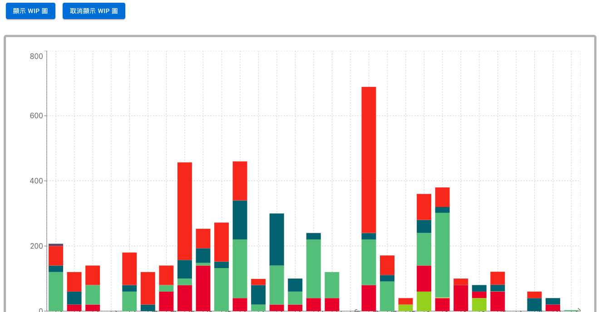
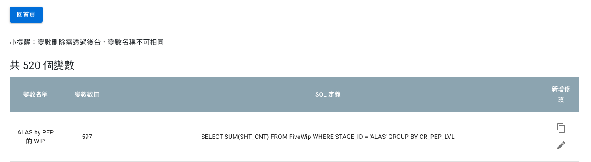
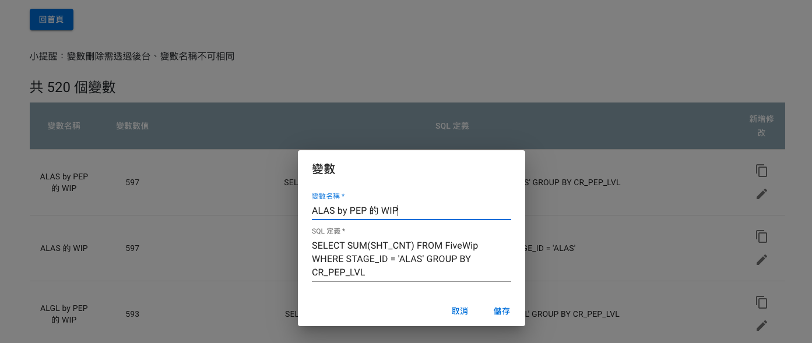
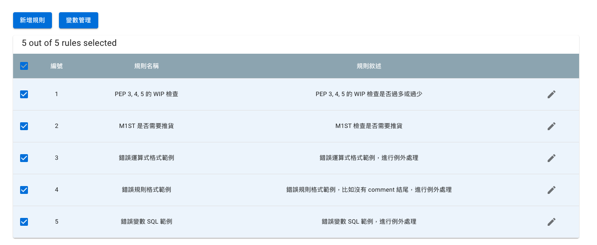
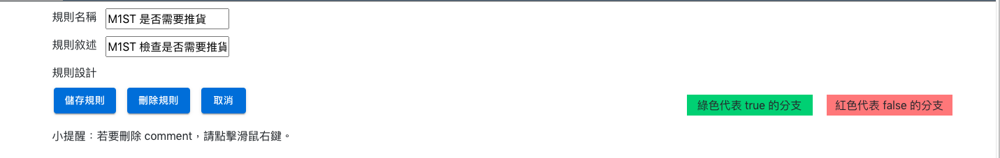
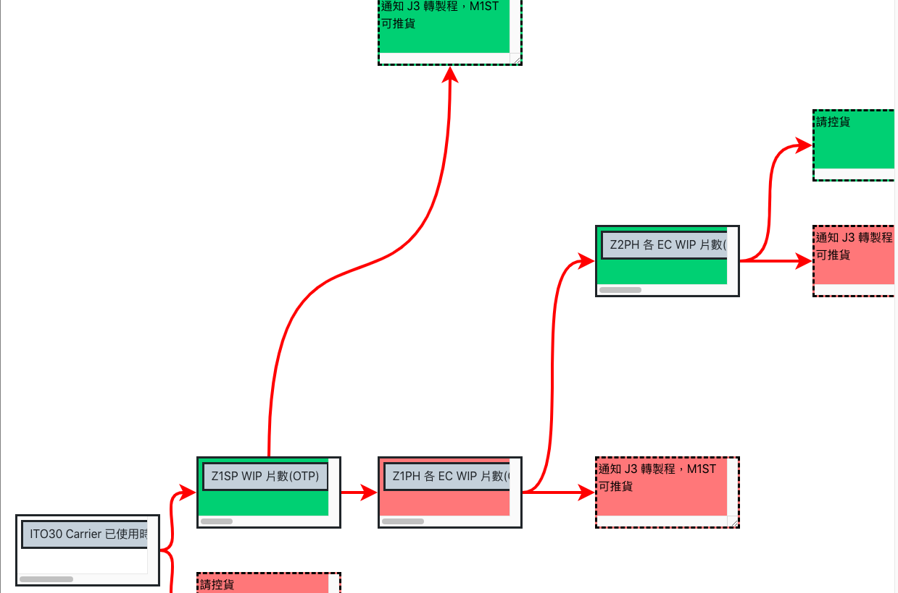
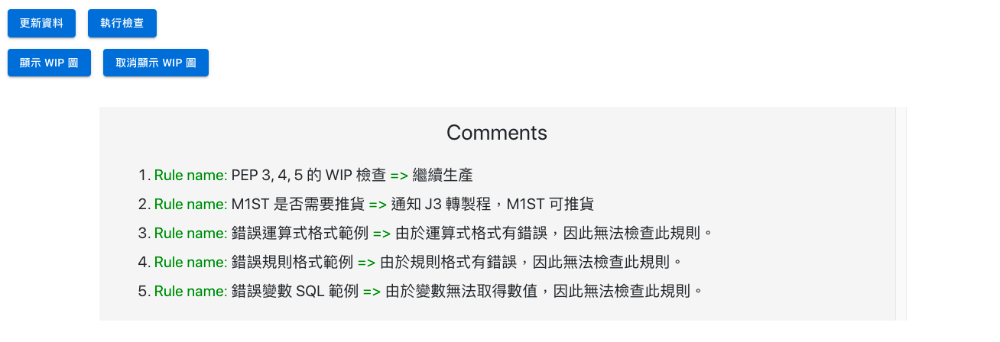
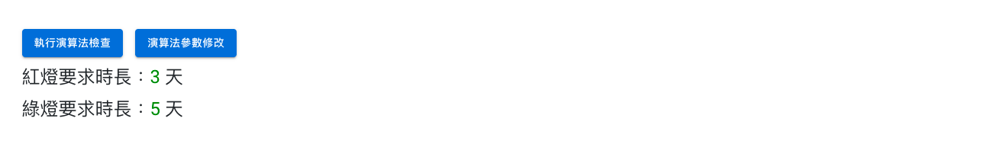
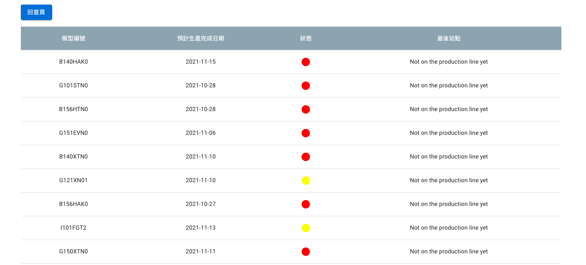

# Rule Checker
推貨輔助決策的前後端系統

## 介紹
該系統提供工廠人員在前端介面中新增變數，以及利用已新增的變數建立二元規則流程圖，流程圖中每一個分支都是一個 true false statement，而最末端節點則為使用者自行輸入的一個 comment。在檢查規則時，後端會自動抓取資料庫的變數資料進行計算，並根據規則流程圖中的判斷依據得出一個 comment，並顯示於前端介面中提供使用者進行推貨決策輔助的依據。

## 功能說明
### 取得在製品分布的長條圖
- 後端會自動取得當下的資料回傳，並在前端利用 recharts 畫出堆疊的長條圖
- 長條圖畫面

### 變數新增、修改
- 使用者可以新增以及修改變數，並在變數中定義 SQL 指令，讓後端能夠順利抓取資料
- 變數畫面

- 修改變數畫面
- 

### 規則新增、修改
- 規則為二元樹狀流程圖，每一個節點都是一個判斷式，分支則為 true false statement，而流程圖最末端為 comment
- 規則表格：紀錄了現有的所有規則
- 
- 規則描述

- 規則流程圖

### 執行規則檢查
- 執行規則檢查時，將使用者勾選的所有規則進行檢查，並一一顯示相對應的檢查結果（comment）

### 執行演算法檢查
- 系統另外提供廠端一個廠端自定義的演算法進行檢查，檢查時一樣會抓取現有資料進行檢查
- 使用者可以任意修改演算法的兩個參數
- 演算法畫面

- 演算法參數修改

- 演算法執行結果

